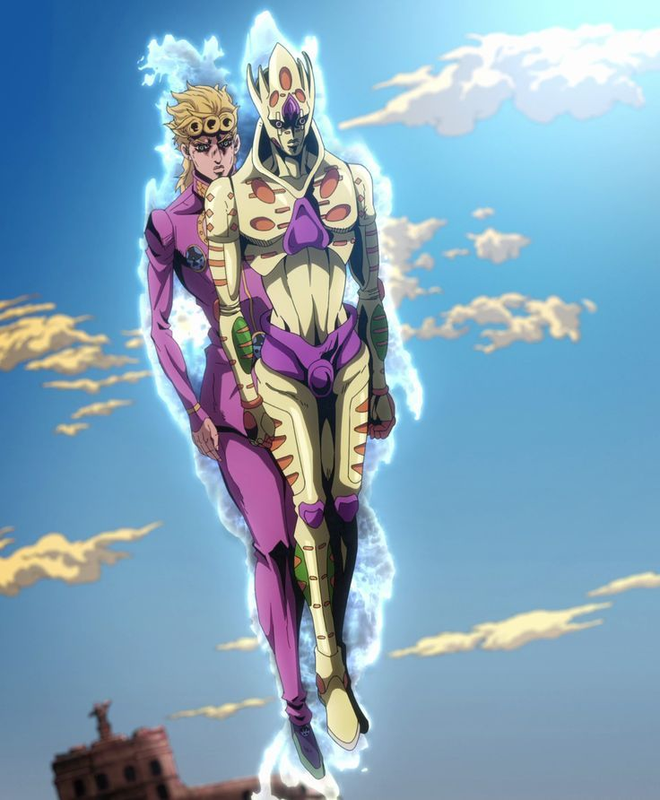

Era of Tijdperk.
Tijdens het kijken van deze anime, zijn er tijden geweest dat ik geen zin meer had om te kijken.

Maar het deel dat ik heel graag keek was het "seizoen" waarin Jotaro Kujo in beeld kwam. Dus ook de eerste Stand. 
Het was een goede overschakeling van oud naar nieuw. Ook al moest ik deze verandering eerst eventjes gewoon worden. 

- Wat is een Stand?
    De komt van het feit dat er iemand naast je staat wanneer je aan het vechhten bent. Het is eigenlijk een bijstander die een specifieke kracht heeft. 
    Elke Stand heeft verschillende krachten, ze zijn elk uniek. Er is geen als de ander. 

